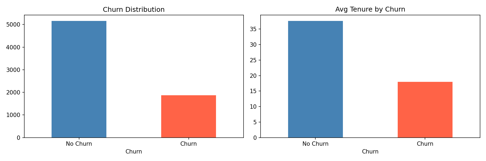
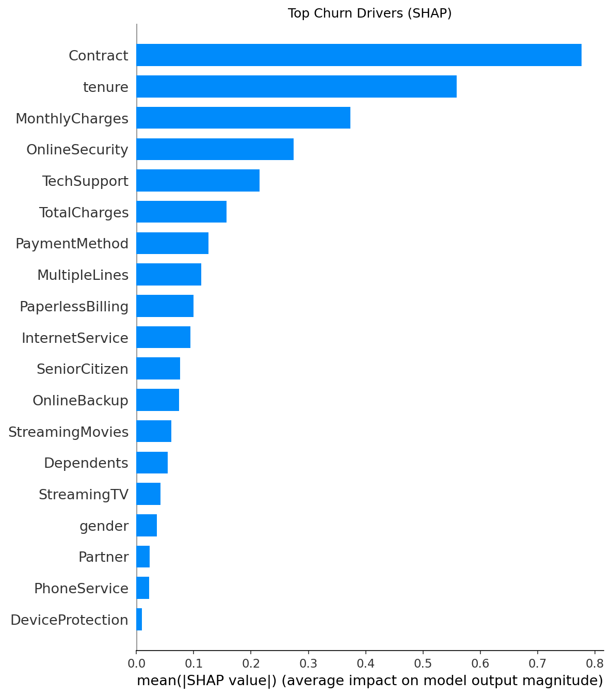
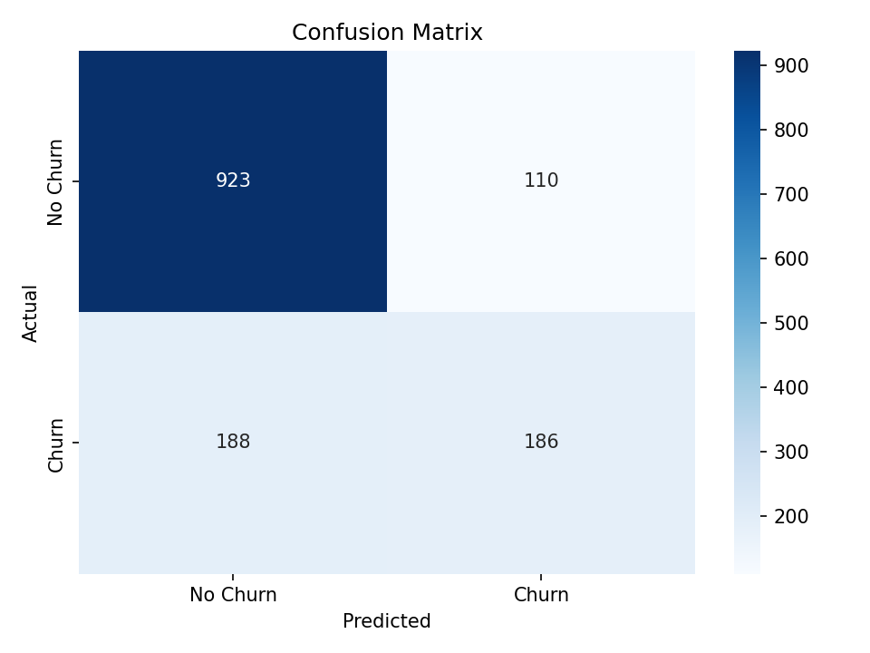

# Customer Churn Prediction

Predicting telecom customer churn with XGBoost and explaining the drivers with SHAP.

## Dataset
IBM Telco Customer Churn sample data: 7,043 customers, 21 features
([source](https://github.com/IBM/telco-customer-churn-on-icp4d)).
After removing 11 rows with blank `TotalCharges`: 7,032 rows. Churn rate: ~26.6%.

## Approach
1. Cleaned data (numeric conversion, dropped missing values, label-encoded categoricals)
2. 80/20 train/test split (stratified)
3. Trained XGBoost; compared against a logistic regression baseline
4. Evaluated with ROC-AUC, precision, recall, and 5-fold cross-validation
5. Explained predictions with SHAP

## Results (test set)
| Model | ROC-AUC | Precision (churn) | Recall (churn) |
|---|---|---|---|
| Logistic Regression | 0.83 | 0.XX | 0.XX |
| XGBoost | 0.83 | 0.63 | 0.50 |
| XGBoost (class-weighted) | 0.83 | 0.50 | 0.80 |

5-fold CV ROC-AUC: XGBoost 0.XX ± 0.0X

## Key findings
- Top drivers (SHAP): Contract type, tenure, monthly charges
- [Add your 2-3 business facts here, e.g. churn rate by contract type]

## Charts

## Tech stack
Python, Pandas, Scikit-Learn, XGBoost, SHAP, Matplotlib, Seaborn

## How to run
pip install pandas numpy scikit-learn xgboost shap matplotlib seaborn jupyter
jupyter notebook Customer_churn_prediction.ipynb
